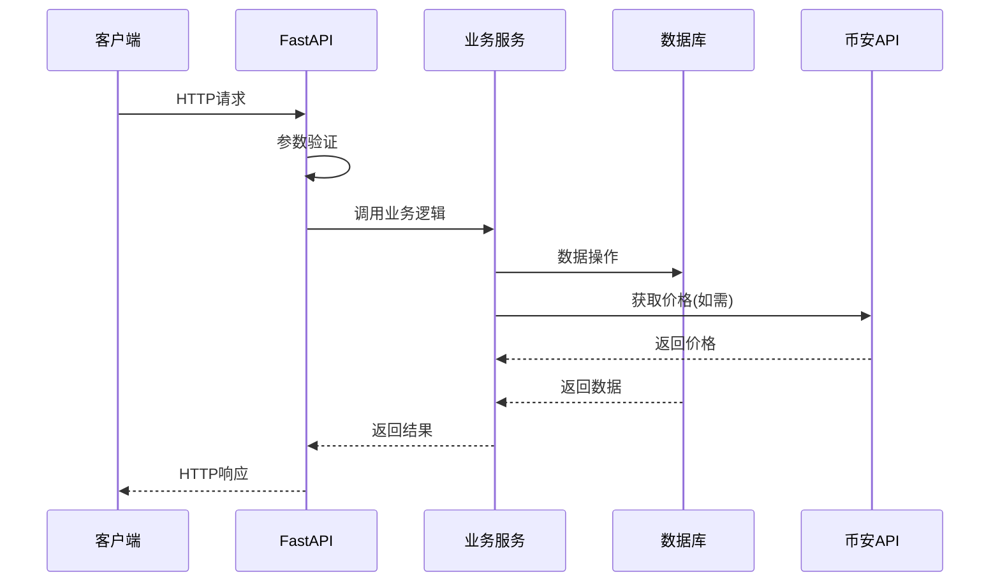
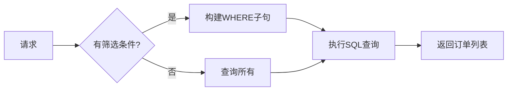
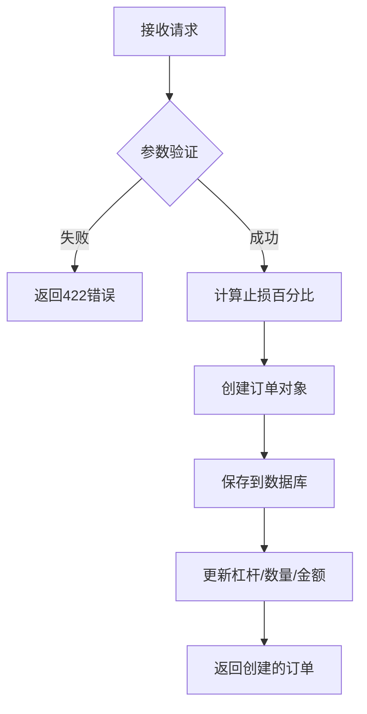
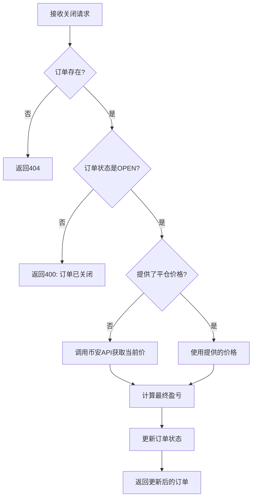
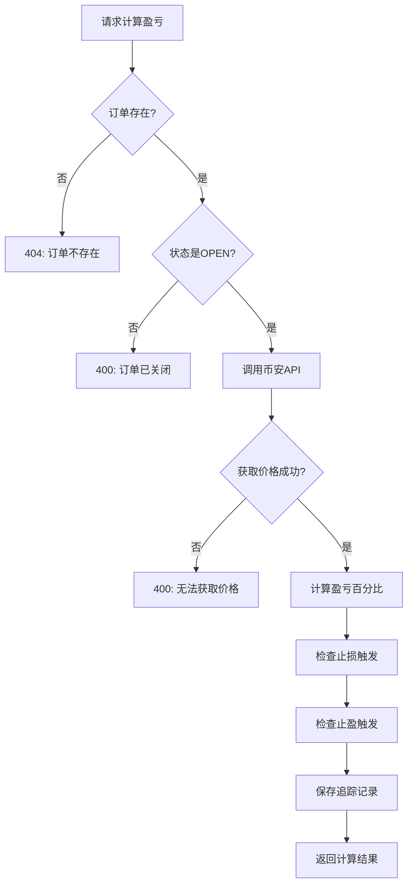

# AlphaPulse API 接口文档

## Base URL
```
http://localhost:8000/api
```

## 接口调用流程



---

## 一、订单管理 `/api/orders`

### 1.1 获取订单列表

```
GET /orders
```

**接口说明：** 获取所有交易订单，支持多条件筛选和分页



**Query Parameters:**

| 参数 | 类型 | 必填 | 默认值 | 说明 | 示例 |
|------|------|------|--------|------|------|
| `symbol` | string | 否 | - | 交易对筛选，精确匹配 | `BTCUSDT` |
| `status` | string | 否 | - | 订单状态筛选 | `OPEN`, `CLOSED`, `STOP_LOSS` |
| `recommendation` | string | 否 | - | 交易方向筛选 | `BUY`, `SELL`, `HOLD` |
| `risk_level` | string | 否 | - | 风险等级筛选 | `LOW`, `MEDIUM`, `HIGH` |
| `start_date` | string | 否 | - | 开始日期，ISO格式 | `2026-01-01` |
| `end_date` | string | 否 | - | 结束日期，ISO格式 | `2026-02-01` |
| `skip` | integer | 否 | 0 | 分页偏移量，用于跳过前N条 | `0`, `50`, `100` |
| `limit` | integer | 否 | 50 | 每页返回数量，最大100 | `10`, `50` |

**Response Model: `List[AITradingOrder]`**

```json
[
    {
        "id": 1,
        "symbol": "BTCUSDT",
        "interval": "4h",
        "recommendation": "BUY",
        "risk_level": "MEDIUM",
        "entry_price": 95000.0,
        "stop_loss": 93000.0,
        "target_t1": 97000.0,
        "target_t2": 99000.0,
        "target_t3": 101000.0,
        "leverage": 10,
        "quantity": 0.01,
        "open_amount": 950.0,
        "status": "OPEN",
        "created_at": "2026-02-01T10:30:00Z",
        "closed_at": null,
        "final_profit_percentage": null,
        "is_win": null
    }
]
```

---

### 1.2 创建订单

```
POST /orders
```

**接口说明：** 手动创建交易订单



**Request Body Parameters:**

| 参数 | 类型 | 必填 | 默认值 | 说明 | 约束 |
|------|------|------|--------|------|------|
| `symbol` | string | ✅是 | - | 交易对名称 | 如 BTCUSDT, ETHUSDT |
| `interval` | string | 否 | `"4h"` | K线周期 | 1m,5m,15m,30m,1h,2h,4h,6h,1d |
| `recommendation` | string | ✅是 | - | 交易方向 | 只能是 `BUY` 或 `SELL` |
| `risk_level` | string | 否 | `"MEDIUM"` | 风险等级 | `LOW`, `MEDIUM`, `HIGH` |
| `entry_price` | float | ✅是 | - | 入场价格 | 必须 > 0 |
| `stop_loss` | float | ✅是 | - | 止损价格 | BUY时<entry_price, SELL时>entry_price |
| `target_t1` | float | 否 | null | 目标价格1 | 第一止盈位 |
| `target_t2` | float | 否 | null | 目标价格2 | 第二止盈位 |
| `target_t3` | float | 否 | null | 目标价格3 | 第三止盈位 |
| `leverage` | float | 否 | 1.0 | 杠杆倍数 | 范围 1-125 |
| `quantity` | float | 否 | null | 交易数量 | 币种数量 |
| `open_amount` | float | 否 | null | 开仓金额 | USDT金额 |
| `analysis_summary` | string | 否 | null | 分析摘要 | 订单备注 |

**Request Example:**
```json
{
    "symbol": "BTCUSDT",
    "interval": "4h",
    "recommendation": "BUY",
    "risk_level": "MEDIUM",
    "entry_price": 95000.0,
    "stop_loss": 93000.0,
    "target_t1": 97000.0,
    "target_t2": 99000.0,
    "target_t3": 101000.0,
    "leverage": 10,
    "quantity": 0.01,
    "open_amount": 950.0,
    "analysis_summary": "AI信号建议做多"
}
```

**Response:** `AITradingOrder` (见1.1响应格式)

---

### 1.3 获取订单详情

```
GET /orders/{order_id}
```

**Path Parameters:**

| 参数 | 类型 | 必填 | 说明 |
|------|------|------|------|
| `order_id` | integer | ✅是 | 订单唯一ID |

**Response:** `AITradingOrder`

**Error Responses:**
| 状态码 | 说明 |
|--------|------|
| 404 | 订单不存在 |

---

### 1.4 关闭订单

```
DELETE /orders/{order_id}
```

**接口说明：** 手动平仓订单



**Path Parameters:**

| 参数 | 类型 | 必填 | 说明 |
|------|------|------|------|
| `order_id` | integer | ✅是 | 订单唯一ID |

**Query Parameters:**

| 参数 | 类型 | 必填 | 默认值 | 说明 |
|------|------|------|--------|------|
| `closed_price` | float | 否 | 自动获取 | 平仓价格，不提供则自动获取当前市场价 |

---

### 1.5 计算单个订单盈亏

```
POST /orders/{order_id}/calculate-profit
```

**接口说明：** 实时获取价格并计算订单当前盈亏



**Path Parameters:**

| 参数 | 类型 | 必填 | 说明 |
|------|------|------|------|
| `order_id` | integer | ✅是 | 订单唯一ID |

**Response Model: `ProfitCalculationResult`**

| 字段 | 类型 | 说明 |
|------|------|------|
| `order_id` | integer | 订单ID |
| `symbol` | string | 交易对 |
| `current_price` | float | 当前市场价格 |
| `entry_price` | float | 入场价格 |
| `profit_percentage` | float | 盈亏百分比 (正为盈利，负为亏损) |
| `is_stop_loss_triggered` | boolean | 是否触发止损 |
| `is_take_profit_triggered` | boolean | 是否触发止盈 |
| `triggered_target` | string | 触发的目标价 (T1/T2/T3) |

**Response Example:**
```json
{
    "order_id": 14,
    "symbol": "BTCUSDT",
    "current_price": 96500.0,
    "entry_price": 95000.0,
    "profit_percentage": 1.578,
    "is_stop_loss_triggered": false,
    "is_take_profit_triggered": false,
    "triggered_target": null
}
```

---

### 1.6 批量计算所有订单盈亏

```
POST /orders/calculate-all-profits
```

**接口说明：** 一次性计算所有OPEN状态订单的盈亏

**Response:**
```json
{
    "message": "Calculated profit for 5 open orders",
    "processed": 5,
    "results": [
        {"order_id": 1, "symbol": "BTCUSDT", "profit_percentage": 1.5},
        {"order_id": 2, "symbol": "ETHUSDT", "profit_percentage": -0.8}
    ]
}
```

---

## 二、仪表盘 `/api/orders/dashboard`

### 2.1 获取仪表盘数据

```
GET /orders/dashboard
```

**Response Model: `DashboardResponse`**

| 字段 | 类型 | 说明 |
|------|------|------|
| `total_profit_percentage` | float | 所有已关闭订单的总盈亏百分比 |
| `total_orders` | integer | 总订单数 |
| `open_orders` | integer | 开放中订单数 |
| `closed_orders` | integer | 已关闭订单数 |
| `win_count` | integer | 盈利订单数 |
| `loss_count` | integer | 亏损订单数 |
| `win_rate` | float | 胜率百分比 |
| `symbol_stats` | array | 按交易对分组的统计 |

---

### 2.2 每日盈亏数据

```
GET /orders/dashboard/daily-profit
```

**Query Parameters:**

| 参数 | 类型 | 必填 | 默认值 | 说明 |
|------|------|------|--------|------|
| `days` | integer | 否 | 30 | 查询天数 |

**Response:**
```json
[
    {"date": "2026-02-01", "total_profit": 2.5, "order_count": 3, "win_count": 2},
    {"date": "2026-01-31", "total_profit": -1.2, "order_count": 2, "win_count": 0}
]
```

---

### 2.3 周期追踪统计

```
GET /orders/dashboard/interval-stats
```

**Response:**
```json
[
    {
        "interval": "30m",
        "tracking_count": 100,
        "avg_profit": 0.52,
        "avg_pnl_ratio": 1.5,
        "stop_loss_count": 10,
        "take_profit_count": 25
    }
]
```

---

### 2.4 收益曲线数据

```
GET /orders/dashboard/profit-curve
```

**接口说明：** 获取累计收益曲线，支持按币种筛选

**Query Parameters:**

| 参数 | 类型 | 必填 | 默认值 | 说明 |
|------|------|------|--------|------|
| `days` | integer | 否 | 90 | 查询天数 |
| `symbol` | string | 否 | null | 筛选币种，为空返回总收益 |

**Response:**
```json
{
    "symbol": "ALL",
    "days": 90,
    "data_points": 45,
    "total_profit_percentage": 12.35,
    "total_profit_amount": 1250.50,
    "curve": [
        {
            "date": "2026-01-15",
            "daily_profit": 1.25,
            "daily_profit_amount": 125.50,
            "cumulative_profit": 1.25,
            "cumulative_profit_amount": 125.50,
            "order_count": 2,
            "win_count": 1,
            "position_value": 10000.0
        },
        {
            "date": "2026-01-16",
            "daily_profit": -0.5,
            "daily_profit_amount": -50.00,
            "cumulative_profit": 0.75,
            "cumulative_profit_amount": 75.50,
            "order_count": 1,
            "win_count": 0,
            "position_value": 5000.0
        }
    ]
}
```

**字段说明：**

| 字段 | 类型 | 说明 |
|------|------|------|
| `total_profit_percentage` | float | 累计收益百分比 |
| `total_profit_amount` | float | 累计收益金额 (USDT) |
| `daily_profit_amount` | float | 日收益金额 = 开仓金额 × 收益百分比 / 100 |
| `cumulative_profit_amount` | float | 累计收益金额 |
| `position_value` | float | 日持仓价值 = 开仓金额 |

---

### 2.5 可用币种列表

```
GET /orders/dashboard/available-symbols
```

**接口说明：** 获取所有有订单的币种列表，用于筛选下拉框

**Response:**
```json
[
    {"symbol": "BTCUSDT", "order_count": 25},
    {"symbol": "ETHUSDT", "order_count": 18},
    {"symbol": "SOLUSDT", "order_count": 12}
]
```

---

## 三、实时追踪 `/api/realtime`

### 3.1 获取订单实时配置

```
GET /realtime/orders/{order_id}
```

### 3.2 启用/禁用实时追踪

```
POST /realtime/orders/{order_id}/enable
POST /realtime/orders/{order_id}/disable
```

### 3.3 更新追踪周期

```
PUT /realtime/orders/{order_id}
```

**Request Body:**

| 参数 | 类型 | 必填 | 说明 |
|------|------|------|------|
| `tracking_interval` | string | ✅是 | 追踪周期: `30m`, `1h`, `2h`, `4h`, `6h` |

---

## 四、定时任务 `/api/scheduler`

### 4.1 调度器状态
```
GET /scheduler/status
```

### 4.2 启动/停止
```
POST /scheduler/start
POST /scheduler/stop
```

### 4.3 任务管理
```
GET /scheduler/jobs
POST /scheduler/jobs
DELETE /scheduler/jobs/{job_id}
```

**创建任务 Request Body:**

| 参数 | 类型 | 必填 | 说明 |
|------|------|------|------|
| `symbol` | string | ✅是 | 交易对 |
| `interval` | string | ✅是 | K线周期 |
| `schedule_type` | string | ✅是 | 调度类型: `m`(分钟), `h`(小时) |
| `schedule_value` | integer | ✅是 | 调度值，如15表示每15分钟 |

---

## 五、盈亏追踪器 `/api/orders/profit-tracker`

### 5.1 获取状态
```
GET /orders/profit-tracker/status
```

### 5.2 启动/停止
```
POST /orders/profit-tracker/start
POST /orders/profit-tracker/stop
```

---

## 错误码说明

| HTTP状态码 | 说明 |
|------------|------|
| 200 | 请求成功 |
| 400 | 请求参数错误或业务逻辑错误 |
| 404 | 资源不存在 |
| 422 | 请求验证失败 |
| 500 | 服务器内部错误 |
