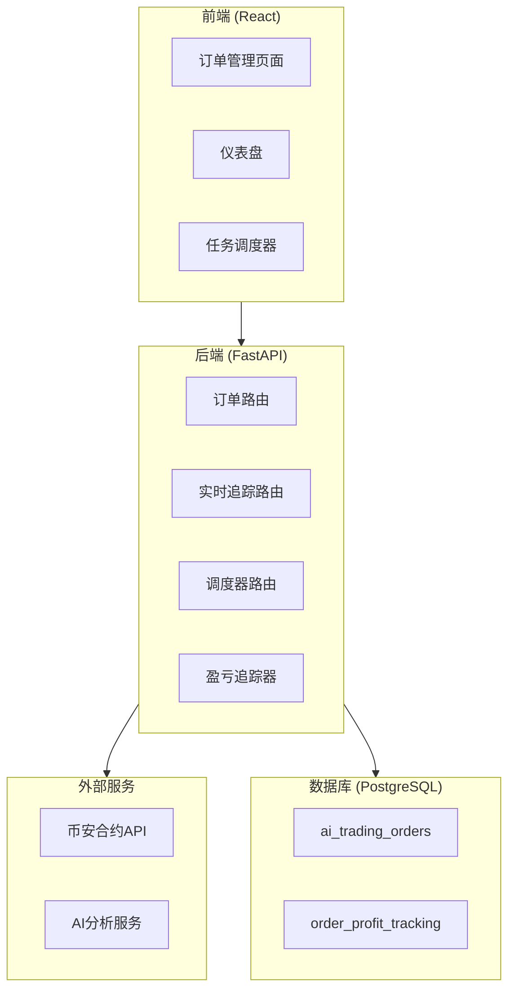
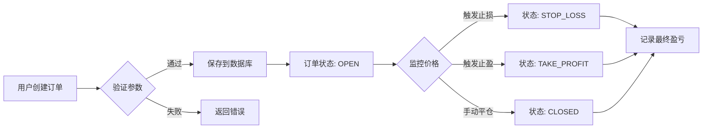
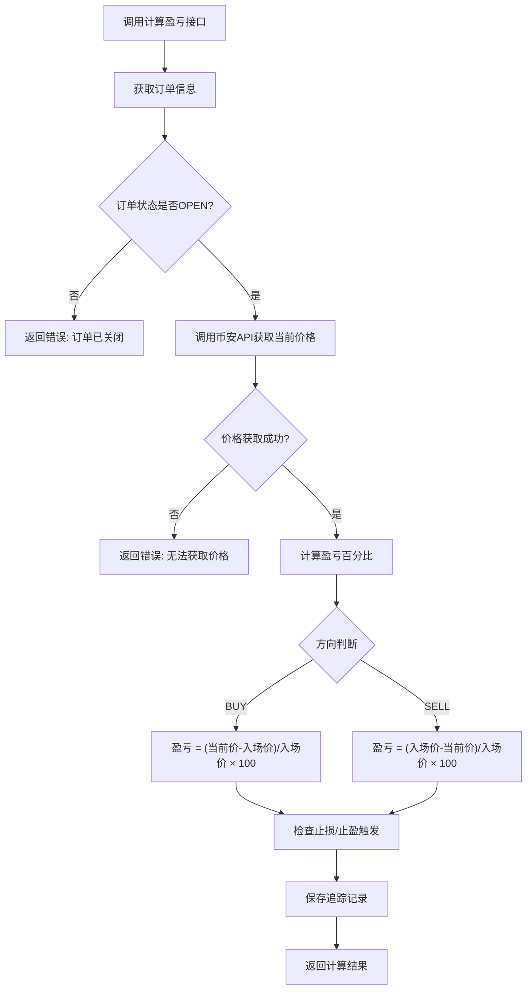
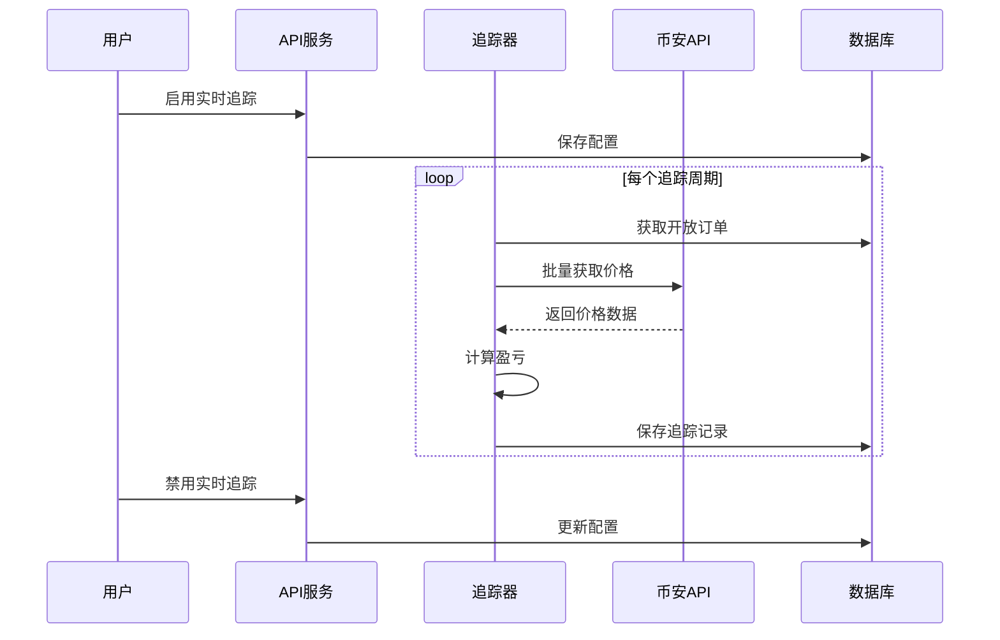
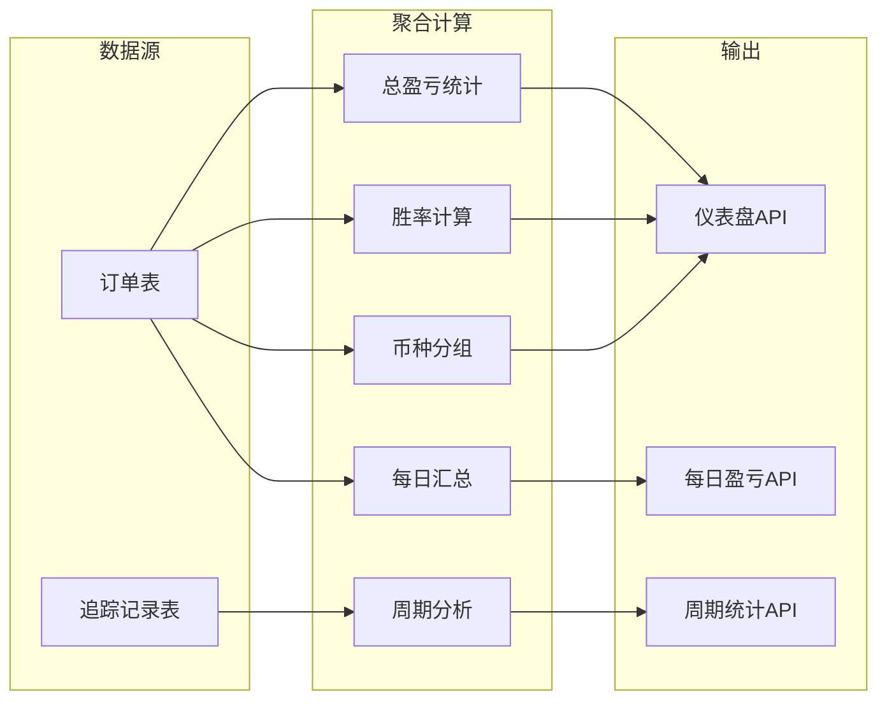
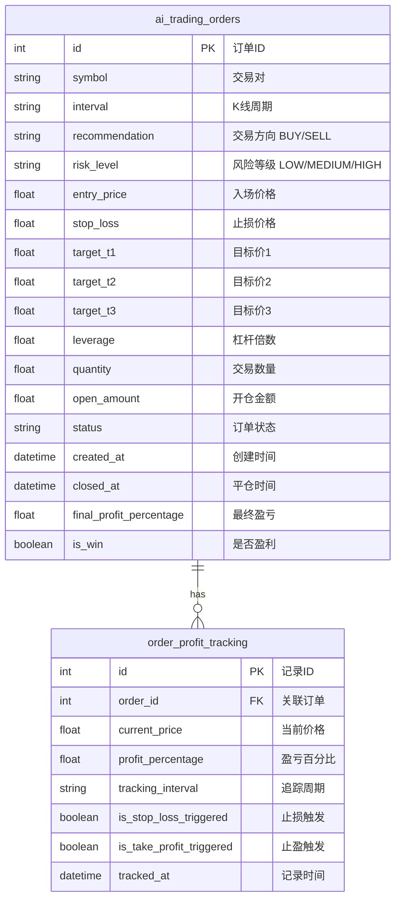
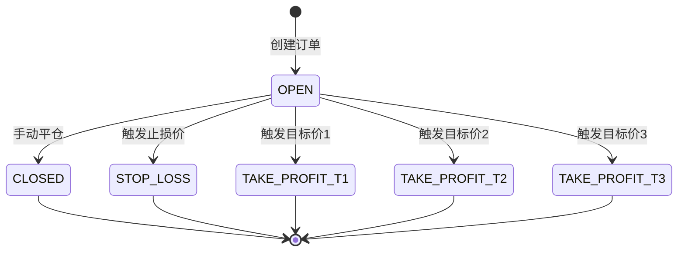

# AlphaPulse 订单管理模块 - 功能文档

## 1. 系统概述

AlphaPulse 是一个AI驱动的加密货币交易平台，提供订单管理、盈亏追踪和数据分析功能。

### 系统架构图



---

## 2. 核心功能模块

### 2.1 订单管理流程



**功能说明：**
| 步骤 | 功能 | 说明 |
|------|------|------|
| 创建订单 | 用户输入交易参数 | 支持交易对、方向、价格、止损止盈 |
| 参数验证 | 检查必填字段 | entry_price, stop_loss 为必填 |
| 保存订单 | 写入数据库 | 自动生成订单ID和时间戳 |
| 价格监控 | 定时获取当前价 | 调用币安API获取实时价格 |
| 状态更新 | 触发条件判断 | 自动更新订单状态 |

---

### 2.2 盈亏计算流程



**计算公式：**
```
# 做多 (BUY)
profit_percentage = ((current_price - entry_price) / entry_price) * 100

# 做空 (SELL)  
profit_percentage = ((entry_price - current_price) / entry_price) * 100

# 杠杆收益
leveraged_profit = profit_percentage * leverage
```

---

### 2.3 实时追踪机制



**追踪周期选项：**
| 周期 | 说明 | 适用场景 |
|------|------|------|
| 30m | 每30分钟追踪 | 高频交易 |
| 1h | 每1小时追踪 | 日内交易 |
| 2h | 每2小时追踪 | 短线交易 |
| 4h | 每4小时追踪 | 波段交易 |
| 6h | 每6小时追踪 | 中长线交易 |

---

### 2.4 仪表盘数据聚合



---

## 3. 数据模型

### 3.1 订单模型 (AITradingOrder)



---

## 4. 状态机

### 订单状态流转



---

## 5. 定时任务

```mermaid
gantt
    title 定时任务执行时间线
    dateFormat HH:mm
    section AI分析
    BTCUSDT 15分钟分析    :a1, 00:00, 15m
    ETHUSDT 15分钟分析    :a2, 00:15, 15m
    section 盈亏追踪
    30分钟追踪任务        :b1, 00:00, 30m
    1小时追踪任务         :b2, 00:00, 60m
```


